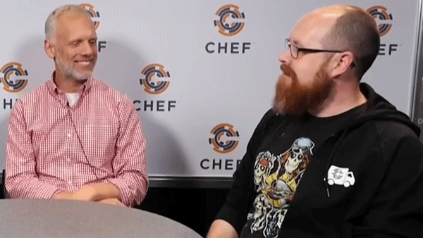

## The Five Love Languages of DevOps

---

# whoami

^ Oh yeah, I'm also @mattstratton on the twitters.

---

## what is this devops thing anyway?

---

---

"A cultural and professional movement, focused on how we build and operate high velocity organizations, born from the experiences of its practitioners."
*-- Chef Style DevOps[^1]*

[^1]: https://youtu.be/_DEToXsgrPc

---

# The Five Love Languages

^ Words of Affirmation
Acts of Service
Receiving Gifts
Quality Time
Physical Touch

---
## What does this have to do with shipping software?

^ We talk a lot about empathy in DevOps. The Five Love Languages is basically about being empathetic. But we need to talk about HOW you do these things, rather than just say "MAKE WITH THE EMPATHY"

---
# CALMS

^ After the first US based Devopsdays in Mountainview 2010 Damon Edwards and John Willis coined the acronym CAMS, which stands for Culture, Automation, Measurement and Sharing. Jez Humble later added an L, standing for Lean, to form CALMS.

^ There are several different models/definitions of DevOps, but for purposes of this discussion, I’m going to use CALMS to specify different focus areas on what DevOps can be.

---
# culture

^ A lot of people say that culture doesn’t matter. J. Paul Reed has talked about that it’s not important to change your culture, but mostly to ensure that your culture is consistent.

^ Culture also has to do with the personality of your organization. You may be an organization that is based on consensus, etc, like we all need to make sure everyone agrees and lets have meetings about meetings and meetings.

---
> You can’t directly change culture. But you can change behavior, and behavior becomes culture
--Lloyd Taylor, VP Infrastructure, Ngmoco

^ Add mention of incenting employees; use Etsy example. You incent for the behavior that you want and then that behavior drives culture which drives further behavior.

---

# automation

^ Stuff like chef, puppet, automated release, automated testing. Manual steps when not needed are a problem.

---
> “Asking experts to do boring and repetitive, and yet technically demanding tasks is the most certain way of ensuring human error, short of sleep deprivation, or inebriation.”
-- *Continuous Delivery*, Jez Humble and David Farley

^ In general, a software process should be automated up to the point where it needs specific human direction or decision making.

---
# lean thinking

^ Lean Thinking is a business methodology which aims to provide a new way to think about how to organize human activities to deliver more benefits to society and value to individuals while eliminating waste.

^ The term Lean Thinking was coined by James P. Womack and Daniel T. Jones to capture the essence of their in-depth study of Toyota’s fabled Toyota Production System.

^ Lean thinking is a new way of thinking any activity and seeing the waste inadvertently generated by the way the process is organized

^ Sometimes people say the "L" stands for Learning (for example, Jason Hand). That's okay. We can still be friends. But for purposes of my talk, it's "Lean"

---
# measurement

^ How do we know if we have been successful if we don’t collect metrics?

^ Measuring is important to start during a transition as well – you can’t go back in time and collect information you didn’t know you wanted at the time.

^ Setting success criteria is very key at the beginning of any transition.

---
# sharing

^ Transparency is key. No “Brents”. First, don’t keep info to yourself to protect yourself. Also, share as much of the “why” – no mandates. Finally, goes to a culture of trust. Blameless postmortems cannot happen in a culture without sharing.

---

# wut?

^ What does this have to do with anything?

---
## each of these is a   “devops love language”

---
> If you find yourself thinking "this is crystal clear to me, why aren’t they seeing it?," that’s more about you than it is about them.
-- –Bill Joy, *Arrested DevOps* Episode 33

^ It’s more important for me to learn to talk to them than for them to learn how to listen to me.

---
### it's not enough to get someone to do it, they need to see the value in their own language

^ Patrick Debois has said (jokingly) that we should rename DevOps to “common sense”. The problem is, common sense is a relative term.

---

# DiSC

- Dominant/Direct
- Influencing
- Steadiness
- Conscientious

^ DiSC is kind of like Meyers Briggs. I like to use DiSC because it’s easier to make a quick assessment (you could be wrong).

---
# Direct
## lean/measurement

^ Someone focused on direct is most likely going to respond to Lean and Measurement. They are results-driven. They want to see how the change helps move the ball forward and are also more likely to be influenced by experimentation.

^ Preaching culture or automation won’t necessarily resonate with them – they care less about the “how”

---
# Influencing
## culture/sharing

^ Influencing types will respond to culture and sharing. They like consensus and they like to collaborate. The results-oriented portions (especially the automation) won’t make as much of a difference to them.

---
# steadiness
## automation/measurement

^ Steadniness like stability. They want to be sure about change and to be comfortable with it. Automation helps them feel safe, and measurement assists in understanding that things really didn’t get messed up. Lean can make an S feel uncomfortable.

---
# conscientious
## sharing/measurement

^ Conscientious folks will respond to sharing and measurement. They love data. They want to measure 30 times and cut once. Lean might scare them. Culture is less of an impact. Automation

---
## assess the drivers

^ Often times we have conflicting incentives. Dev incented to ship features quickly. Ops incented for uptime (nancy example).

^ These may actually not be at odds. Ultimately our driver should be to move the biz forward, at a macro level, but we have our individual incentives.

^ Changing these isn’t always right. Understanding what appears to be a conflict may actually help. Ship changes at a higher velocity can actually increase the stability of a system b/c small batch changes are more stable. Ship more frequently actually helps both dev and ops.

^ Similarly, caring out uptime and stability can enable the dev to ship more features as they are not caught up in troubleshooting and have more resources available from ops, etc.

^ Drive: The Surprising Truth About What Motivates Use - Daniel H. Pink

---
## be a salesperson

^ Talk about the Challenger Sale.

^ “(Challengers have) a deep understanding of the customer’s business and use that understanding to push the customer’s thinking and teach them something new about how their company can compete more effectively.”

^ If you’re not comfortable with being a salesperson, find a buddy who is.

---
## talk their language

^ The key is to look at your key influencer as your client instead of your boss for the purpose of this project.

^ If your client (who happens to be your boss) shoots down your ideas and offers a counter plan, you have to be ready to channel some boldness and stand firm in your beliefs. Instead of arguing back and forth or worse, completely backing down because of his/her position above you in the company, you could say something like “I see what you’re saying, but if we do it your way, this is what is going to happen”, and then lay out how their plan is flawed.

---
## compliance vs. commitment

^ The Compliant One: The compliant person will sign the documents, put their time in, “do their TPS Reports, punch the clock. They’ll do it because they need a job, or are too lazy to leave. Whatever the reason, they’ll make the changes, but won’t really care much about it.

^ The Committed One: The commitment person will simply, “Believe in the TPS Reports”. They’re dedicated to the idea of change and are committed to the success of the company.
As you have more commitment, the success of your company will be exponential.

---
### the best change influencers are those who don’t see people as something they ‘have to deal with’.

^ they’re authentically interested in them, and enjoy the pursuit of the how of change more than the change itself.

---
## bring people along for the ride

^ Don't dictate; let the influencers and stakeholder take an active part in the change

^ Don’t let it just be a venting session – we can all talk about how we got where we are, but this is about moving the needle forward.

---

# Questions?

---

## more Stuff

- http://arresteddevops.com/devops-culture-change/
- https://github.com/chef/devops-kungfu
- @mattstratton on the twitters
- https://github.com/mattstratton on the githubs
- http://www.ted.com/talks/dan_pink_on_motivation
